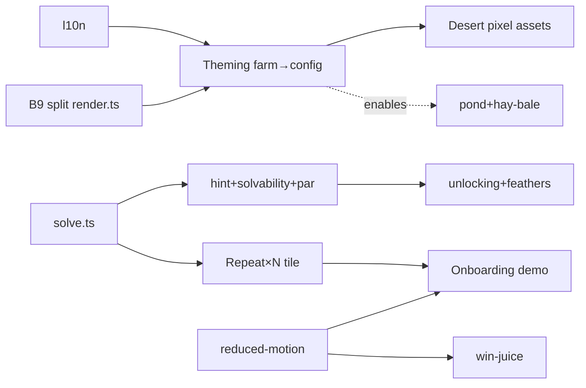

# lugame — Improvement Roadmap

Single prioritized plan synthesizing the three 2026-07-25 audits. **Detail lives
in the audits; this is the index + recommended order.** Re-run an audit after a
tier lands.

- Audits: [`docs/audits/code-quality.md`](audits/code-quality.md) · [`gameplay.md`](audits/gameplay.md) · [`ui-ux.md`](audits/ui-ux.md) (+ `screenshots/`)
- Context: [`PRODUCT.md`](../PRODUCT.md) · [`DESIGN.md`](../DESIGN.md) · [`docs/decisions.md`](decisions.md)
- In-flight designs: [`l10n-design.md`](l10n-design.md) · [`theming-design.md`](theming-design.md)

## Converged P0 — ✅ FIXED (2026-07-25)

Both were flagged by multiple audits independently; both landed in the a11y fix pass:

| # | Issue | Status |
|---|---|---|
| P0-1 | `prefers-reduced-motion` | ✅ FIXED — CSS `@media` neutralises `chip-err`/`badge-pop`; `render.ts` `REDUCED` flag gates hops / fan-shake / bump-shake / sparkles / confetti (keeps the step-chip highlight). Verified via DevTools emulation. |
| P0-2 | Contrast fails WCAG AA | ✅ FIXED — 6 tokens darkened (hue kept) to 4.60–4.65:1 white-text, verified live via `getComputedStyle`. Farm palette slightly darker as a result. |

## Landed this session (2026-07-25)

- ✅ **l10n** ([l10n-design.md](l10n-design.md), ADR-0007) — `src/locales/{nl,en,types}.ts` + Proxy `T` runtime + EN + language picker.
- ✅ **theming** ([theming-design.md](theming-design.md), ADR-0006) — `src/game/theme.ts` + `ConfigTileset` + farm (pixel-identical) + desert (real CC0 assets) + theme picker + cross-theme animal fallback. Bundle 22.71 KB gz.
- ✅ **a11y fix pass** — P0-1, P0-2, N1, N3, N4 done; touch targets (N2 partial); `:focus-visible` added.
- ✅ **Win confetti** (was dead code) — `render.ts` `spawnConfetti`/`stepConfetti`/`drawConfetti` existed but were never called; now wired on the `won` phase transition via `prevPhase`, particles culled past the canvas, reduced-motion gated. (commit `516e56a`)
- ✅ **Directional peacock sprite** — replaces the 🦚 emoji with `public/assets/img/peacock-walk.png` (4 cols R,D,U,L × 3-frame walk cycle); direction map verified per-frame by pixel analysis. `peacock-folded.png` shipped but reserved (its Up/Down frames are ambiguous). (commit `516e56a`)
- 🟢 **In-flight (parallel agents):** N2-finish, N5+N6, N8, B1 (`src/game/solve.ts`). N7 (tsconfig flags) runs after, sequentially (it cascades type errors into every file).

## Now — alpha polish (cheap · high-value · low-risk)

| # | Item | Audit | Files | Effort |
|---|---|---|---|---|
| N1 | Chip remove ✕ invisible on touch + 17px → always-show on `@media(hover:none)`, ≥24px | ui-ux Q-1 · gameplay | style.css:226-242, palette.ts | S |
| N2 | Touch targets: custom-delete 34→44px, editor ± →44px | ui-ux L-1/E-1 | style.css:567-577, editor.ts | S |
| N3 | Exhaustiveness `never`-checks in `dirVec`/`doStep`/`play` | code-quality F5 | types.ts:57, engine.ts:201, audio.ts:137 | S |
| N4 | Stop rebuilding `pathSet` per frame — use `engine.pathSet` | code-quality F7 | render.ts:410 | S |
| N5 | Overlays → real dialogs (`role=dialog`, `aria-modal`, focus trap/restore) | code-quality F6 | palette.ts:146,173,207,223 | M |
| N6 | Confirm before deleting a custom level | ui-ux L-2 | palette.ts | S |
| N7 | tsconfig flags: `noUncheckedIndexedAccess` (highest-value), `noUnusedLocals`, `noImplicitReturns`, `verbatimModuleSyntax` | code-quality F9 | tsconfig.json | S |
| N8 | Drop duplicate `new GameEngine(LEVELS[0])` field-init; guard `getElementById('app')`; debounce resize | code-quality F26/F27/F20 | main.ts:57,66,99 | S |

## Next — beta (teaching + depth)

| # | Item | Audit | Files | Effort |
|---|---|---|---|---|
| B1 | **`src/game/solve.ts`** — promote the throwaway `/tmp/solve.py` BFS into the codebase (pure `solve(level, fromState?)`) | gameplay C | new src/game/solve.ts | M |
| B2 | Ghost-path **hint** (💡) + editor **solvability check** + star **par** — all built on B1 | gameplay C | palette.ts, editor.ts, render.ts | M |
| B3 | **No-reading onboarding demo** (translucent 👆 auto-taps + auto-runs; per-mechanic localStorage flag; replayable from settings) | gameplay B/G1 | palette.ts, main.ts | M/L |
| B4 | **`Repeat ×N` tile** (two fixed tiles ×2/×3 — age-appropriate loop; no counter) | gameplay A | types.ts, engine.ts, palette.ts, levels.ts | M |
| B5 | **Level unlocking + feather 🪶 collection** (padlock until cleared; feathers = plumage total; parent free-play toggle) | gameplay D/G5 | storage.ts, palette.ts | M |
| B6 | Chip **shapes** (colour-blind safety) + step **speed control** | gameplay E | render.ts, palette.ts, settings | S/M |
| B7 | **Too-tired cue** (distinct sound when fan fires at 0 energy) + **single-step debug** | gameplay H/G9 | audio.ts, engine.ts, main.ts | S |
| B8 | **Tooling:** ESLint (flat) + Prettier + Vitest harness + `ci.yml` lint/test/typecheck job | code-quality §6 | new config + .github/ | M |
| B9 | **Split `render.ts`** → `tileset.ts` + `particles.ts` + `render.ts` (makes theme seam a file boundary) | code-quality F13 | render.ts | M |

## Later — v1 (content + ambition)

| # | Item | Audit | Files | Effort |
|---|---|---|---|---|
| V1 | New obstacles: **pond** (impassable, visual variety) + **hay bale** (destructible by fan — deepens the signature mechanic) | gameplay G | types.ts, engine.ts, render.ts, levels.ts | M |
| V2 | **Win-juice depth**: chomp-the-last-cookie, triumphant fan-on-win, variable reward | gameplay F | render.ts:788, audio.ts | S/M |
| V3 | **Theme content**: real CC0 desert pixel tiles/decor/bgm (procedural fallback ships first) | theming | public/themes/desert/ | M |
| V4 | Engine **view-model** (`getSnapshot()`) so the renderer consumes a contract, not internals | code-quality F12 | engine.ts, render.ts | M |
| V5 | Editor **model/view split** (kill the per-cell grid rebuild storm on drag) | code-quality F8 | editor.ts | M |
| V6 | Extract shared **validators** (`isPos`/`isDir`/`isValidLevel`) — reuse in editor paste | code-quality F11 | new src/game/validate.ts | S |
| V7 | Landscape mobile layout (`@media (orientation:landscape)`) | ui-ux R-1 | style.css | S |

## Dependency graph

## Rejected / deferred (don't re-propose)

Text hints (pre-literate) · timers / time pressure · harsh game-over · backend
accounts / real-time multiplayer · general loops/procedures/conditionals with
counters/bodies (too abstract for 4yo — `Repeat ×N` is the age-appropriate form)
· daily levels · parent dashboards · jump command · tractor · cosmetic day/night
· in-app purchases · per-theme player characters (peacock + fan stay global).
Reasons per item: [`docs/audits/gameplay.md` §6](audits/gameplay.md).
